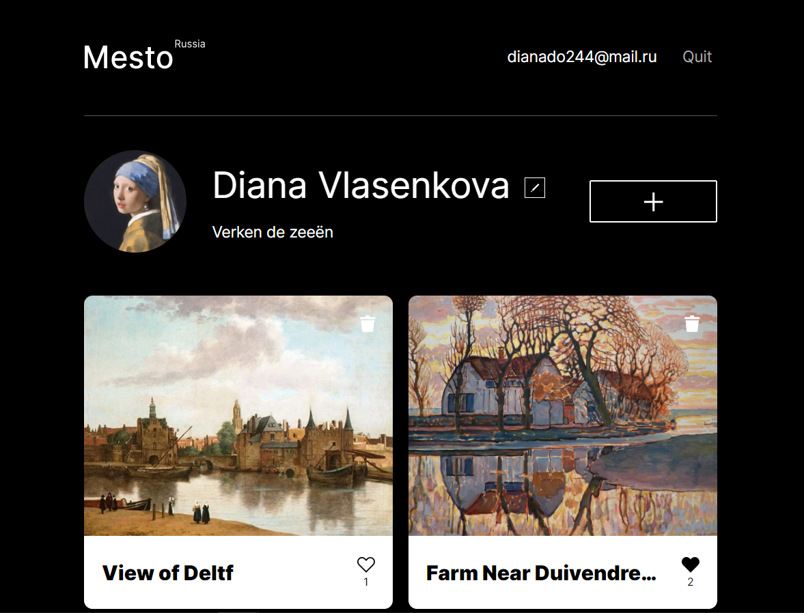
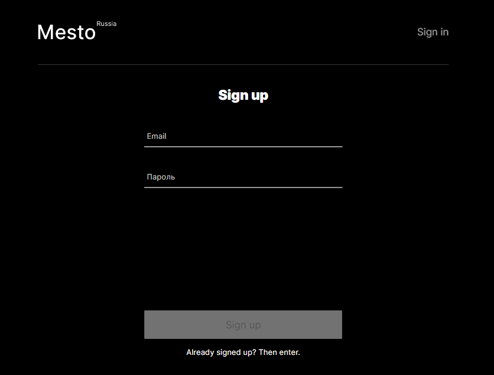
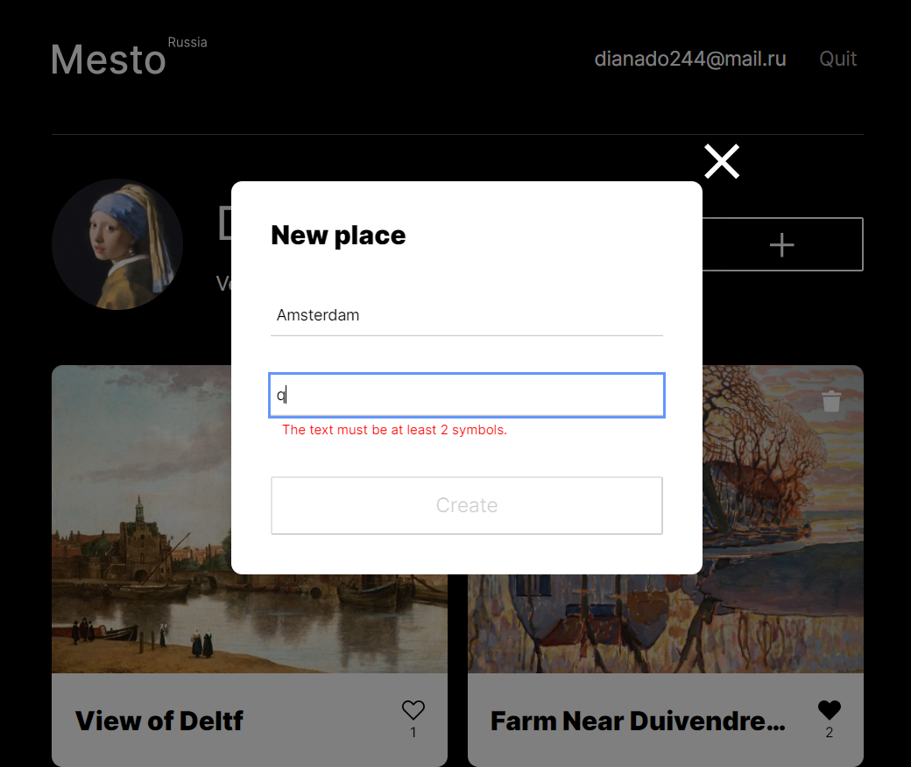
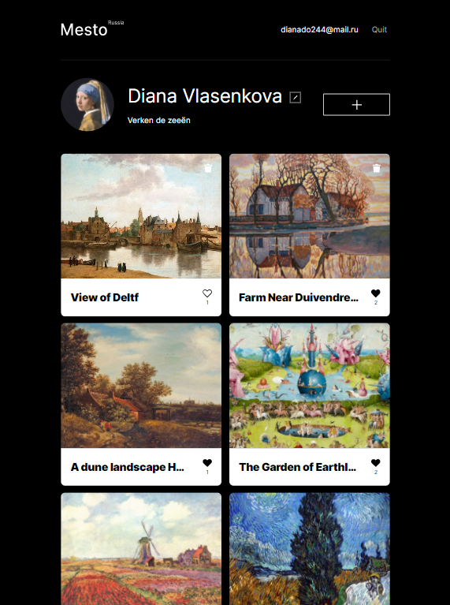

# :large_blue_diamond: A study project at Practicum by Yandex :large_blue_diamond:

A single-page application that simulates a user's page with a gallery. 

Frontend and backend, full MERN functionality.

:small_blue_diamond: **App functions:** :small_blue_diamond:
  - registration
  - logging in
  - editing a profile info and avatar
  - adding images to the gallery via url-links
  - deleting images
  - putting likes.

---
## :mag_right: Preview

---
## :link: Links to test 

- Project link: https://dianadomino24.students.nomoreparties.space

- Backend domain name: http://api.dianadomino24.students.nomoreparties.space

- Public IP: 178.154.233.146

---
## :rocket: Technologies 

* **JavaScript ES6** - object-oriented programming, fetch API,

* semantic **HTML5**, styles - **CSS3** including Flexbox, Grid, adaptive layout,
* **jsx**,
* **BEM** methodology,

* **React.js** - functional and class components, Context, Ref, Redirect, Route, Switch functions, 
* **React hooks** - useState, useEffect, useContext, useRef, useCallback, useHistory,
* **Create React App** build,

* **Node.js**, **Express.js** - API based on **REST** principles for working with the database, authentication/authorization,
* **MongoDb**, **Mongoose** - schema, CRUD operations,
* Yandex.Cloud service **Virtual Machine**,

* Client-side and user-side validation of data including  **validator** and **joi/celebrate** modules, jwt-token,
* **BodyParser**, **DotENV**, **bCrypt**, **Nodemon**,
* Access and error logs are maintained using the **winston** module,
* **Centralized error handling** with sending correct statuses and error messages to requests,
* Working with files/API requests is divided between the Node and **Nginx** servers,

* **ESLint airbnb-base**,
* **Figma**, **Pixel perfect**,

* **Git** versions, branches.

---

**Practicum by Yandex** - https://practicum.yandex.com/

---

## :sparkles: Thanks for watching! :sparkles:

